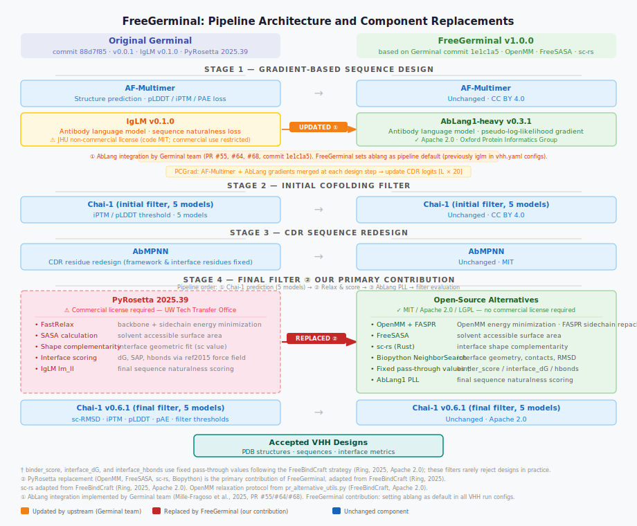

# FreeGerminal

**A commercially permissive implementation of the [Germinal](https://github.com/SantiagoMille/germinal) VHH antibody design pipeline.**

FreeGerminal replaces the two non-commercial dependencies in Germinal — PyRosetta and IgLM — with fully open-source, commercially licensed alternatives, enabling the pipeline to be used in academic and commercial settings without licensing barriers.

> ⚠️ **Preprint coming soon.** Code is released ahead of publication to establish priority. Please cite both FreeGerminal and the original Germinal paper (see [Citation](#citation)).

---

## What Changed

| Component | Original Germinal | FreeGerminal | License |
|---|---|---|---|
| Antibody LM (gradient) | IgLM | AbLang1-heavy v0.3.1 | Apache 2.0 |
| Structure relaxation | PyRosetta FastRelax | OpenMM + FASPR | MIT / Apache 2.0 |
| SASA calculation | PyRosetta | FreeSASA | LGPL |
| Shape complementarity | PyRosetta | sc-rs | MIT |
| Interface geometry | PyRosetta | Biopython | MIT |
| Structure prediction | AF-Multimer | AF-Multimer | CC BY 4.0 |
| Final filter | Chai-1 | Chai-1 | Apache 2.0 |
| Sequence redesign | AbMPNN | AbMPNN | MIT |

> **Note:** AbLang integration was implemented by the Germinal team (commit `1e1c1a5`, PR #55/#64/#68). FreeGerminal adopts this update and sets AbLang as the default for all VHH run configurations. The primary contribution of FreeGerminal is the PyRosetta replacement.

> **Known approximations (inherited from [FreeBindCraft](https://github.com/cytokineking/FreeBindCraft)):** `binder_score`, `interface_dG`, and `interface_hbonds` use fixed pass-through values, as these metrics depend on the Rosetta force field and have no open-source equivalent. These filters rarely reject designs in practice.

---

## Pipeline Overview



---

## Requirements

- Linux x86_64
- NVIDIA GPU with ≥ 40 GB VRAM (A100 recommended)
- Apptainer / Singularity
- AF-Multimer parameters (see below)
- Chai-1 weights (auto-downloaded on first run)

---

## Installation

### 1. Download the container

```bash
# Option A: Pull from Docker Hub (coming soon)
apptainer pull freegerminal_v1.0.0.sif docker://teaninja/freegerminal:v1.0.0

# Option B: Build from source
git clone https://github.com/teaninja/FreeGerminal.git
cd FreeGerminal
docker build -f Dockerfile.free -t freegerminal:v1.0.0 .
docker save freegerminal:v1.0.0 | gzip > freegerminal_docker.tar.gz
# Convert to sif on HPC:
apptainer build --fakeroot freegerminal_v1.0.0.sif docker-archive://freegerminal_docker.tar.gz
```

### 2. Download AF-Multimer parameters

```bash
mkdir -p params && cd params
aria2c -q -x 16 https://storage.googleapis.com/alphafold/alphafold_params_2022-12-06.tar
tar -xf alphafold_params_2022-12-06.tar
rm alphafold_params_2022-12-06.tar
```

Alternatively, extract from an existing `germinal.sif`:
```bash
apptainer exec germinal.sif tar -cf params_from_sif.tar /workspace/params
tar -xf params_from_sif.tar --strip-components=2 -C params/
```

### 3. Prepare AbLang weights directory

AbLang weights are downloaded automatically on the first run. Provide a writable directory:

```bash
mkdir -p ablang_weights
```

---

## Usage

### Directory structure

```
/your/workdir/
  freegerminal_v1.0.0.sif
  params/                    ← AF-Multimer parameters
  pdbs/
    nb.pdb                   ← VHH framework template
    <antigen>.pdb             ← target antigen structure
  chai_cache/                ← Chai-1 weights (auto-downloaded)
  ablang_weights/            ← AbLang weights (auto-downloaded)
  results/                   ← output directory
  <jobname>/
    <target>.yaml            ← target configuration
    run.sh                   ← SLURM submission script
```

### Target configuration (YAML)

```yaml
target_name: pdl1
target_pdb_path: pdbs/pdl1.pdb
target_chain: A
binder_chain: B
target_hotspots: A37,A39,A41,A96,A98
hotspot_residue: W40
dimer: false
structure_model: chai
```

### SLURM submission script

```bash
#!/bin/bash
#SBATCH -p gpu
#SBATCH --gres=gpu:a100:1
#SBATCH --nodes=1
#SBATCH -c 8
#SBATCH --mem=80G
#SBATCH --time=12:00:00
#SBATCH --account=<your_account>

cd /your/workdir
module load apptainer

apptainer exec --nv \
  --bind $PWD/params:/workspace/params \
  --bind $PWD/results:/workspace/results \
  --bind $PWD/pdbs:/workspace/pdbs \
  --bind $PWD/chai_cache:/opt/conda/envs/germinal/lib/python3.10/site-packages/downloads \
  --bind $PWD/ablang_weights:/opt/conda/envs/germinal/lib/python3.10/site-packages/ablang2/model-weights-ablang1-heavy \
  --bind $PWD/<jobname>/<target>.yaml:/workspace/configs/target/<target>.yaml \
  --pwd /workspace \
  freegerminal_v1.0.0.sif \
  python run_germinal.py target=<target> experiment_name=<exp> structure_model=chai
```

---

## Benchmark

Tested on UVA Rivanna HPC (NVIDIA A100 80GB) against original Germinal (commit `88d7f85`).

| Metric | Original Germinal | FreeGerminal v1.0.0 |
|---|---|---|
| PD-L1 accepted designs | 7 / 172 trajectories (4.1%) | 3 / 32 trajectories (9.4%) |
| IL-3 accepted designs | 0 / 223 trajectories | 0 / 37 trajectories |
| Avg. time per trajectory | ~167 sec | ~268 sec |
| PyRosetta required | ✅ Yes | ❌ No |
| IgLM required | ✅ Yes | ❌ No |
| Commercial use | ⚠️ License required | ✅ Free |

> **For full methods, benchmark details, and analysis, see the accompanying paper (preprint coming soon).**

> Trajectory counts differ because FreeGerminal jobs experienced intermittent cluster node failures unrelated to the pipeline. Per-trajectory runtime is ~60% slower due to OpenMM relaxation replacing PyRosetta FastRelax; FASPR sidechain repacking is included.

---

## License

FreeGerminal code modifications are released under the **MIT License**.

This repository builds upon:
- [Germinal](https://github.com/SantiagoMille/germinal) (MIT) — Mille-Fragoso et al., 2025
- [FreeBindCraft](https://github.com/cytokineking/FreeBindCraft) (Apache 2.0) — Ring, 2025
- [AbLang2](https://github.com/oxpig/AbLang2) (Apache 2.0) — Oxford Protein Informatics Group
- [OpenMM](https://openmm.org) (MIT)
- [FreeSASA](https://freesasa.github.io) (LGPL)

---

## Citation

If you use FreeGerminal, please cite:

```bibtex
@article{freegerminal2026,
  title   = {FreeGerminal: A Commercially Permissive Implementation of the Germinal VHH Antibody Design Pipeline},
  author  = {Bing Han and Anne K. Kenworthy},
  journal = {bioRxiv},
  year    = {2026},
  note    = {Preprint}
}
```

Please also cite the original Germinal paper:

```bibtex
@article{germinal2025,
  title   = {Germinal: De novo VHH antibody design with a language model-guided diffusion framework},
  author  = {Mille-Fragoso, Santiago and others},
  journal = {bioRxiv},
  year    = {2025}
}
```

---

## Affiliation

Department of Molecular Physiology and Biological Physics, University of Virginia School of Medicine  
[Kenworthy Lab](https://med.virginia.edu/kenworthy-lab/)

---

## Acknowledgments

FreeGerminal is built on the work of the Germinal team (Santiago Mille-Fragoso et al.) and draws on the PyRosetta-free approach pioneered by FreeBindCraft (Aaron Ring, Ariax Bio). We thank both teams for making their work open source.
